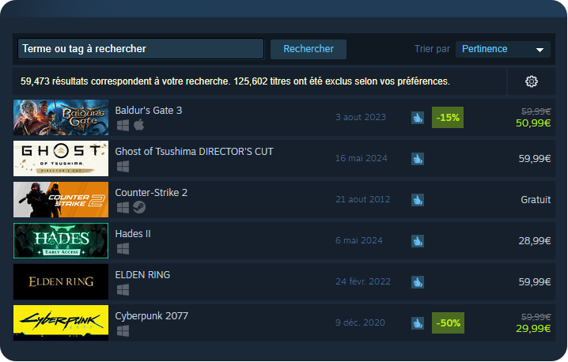

# Steam Search UI Enhancer

## Description

**Steam Search UI Enhancer** is a Chrome extension that enhances the user interface of the Steam search page. It adds color coding based on game ratings and simplifies the UI to easily spot the highest-rated games.

## Features

- Adds color coding based on game ratings.
- Simplifies the user interface for more intuitive navigation.
- Clearly displays the highest-rated games.

## Screenshots

### Before



### After


## Installation

1. Clone this repository to your local machine:
   ```sh
   git clone https://github.com/nvigneux/steam-search-ui-enhancer.git
   ```
2. Install the necessary dependencies:
   ```sh
   cd steam-search-ui-enhancer
   yarn install
   ```
3. Start the application in development mode:
   ```sh
   yarn start
   ```
4. Open [http://localhost:3000](http://localhost:3000) to view it in the browser.
5. Load the extension in Chrome:
   - Build `yarn build`
   - Open `chrome://extensions/`.
   - Enable `Developer mode`.
   - Click `Load unpacked` and select the `build` folder of your project.

## Commit Convention

Each commit message should be prefixed with these annotations:

- **New feature**: [+]
- **Refactoring, WIP, working on code**: [*]
- **Fix**: [#]
- **Code or assets deletion**: [-]

## Available Scripts

In the project directory, you can run:

### `yarn start`

Runs the app in development mode.\
Open [http://localhost:3000](http://localhost:3000) to view it in the browser.

### `yarn test`

Launches the test runner in interactive watch mode.\
See the section about [running tests](https://facebook.github.io/create-react-app/docs/running-tests) for more information.

### `yarn build`

Builds the app for production to the `build` folder.\
It correctly bundles React in production mode and optimizes the build for the best performance.

### `yarn eject`

**Note:** This is a one-way operation. Once you `eject`, you can’t go back!

## Learn More

You can learn more in the [Create React App documentation](https://facebook.github.io/create-react-app/docs/getting-started).

To learn React, check out the [React documentation](https://reactjs.org/).

## Contribution

Contributions are welcome! Please submit a pull request or open an issue to discuss the changes you want to make.

# Support me
### If you find these resources helpful for your projects or simply enjoy the project, consider supporting.
[](https://www.buymeacoffee.com/nvigneux?path=readme)
